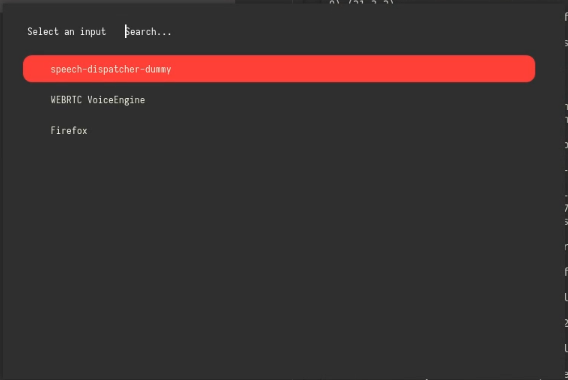
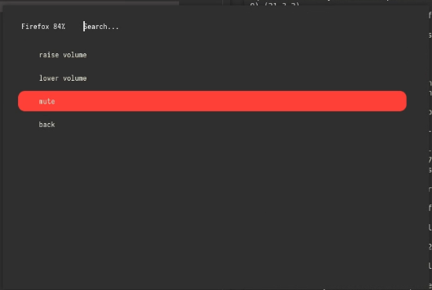

# Control PulseAudio with rofi

This is a simple python script to control PulseAudio sink input volumes using rofi. This is useful for people using a tiling window manager with rofi as their application launcher/window switcher/whatever else.

### Images

